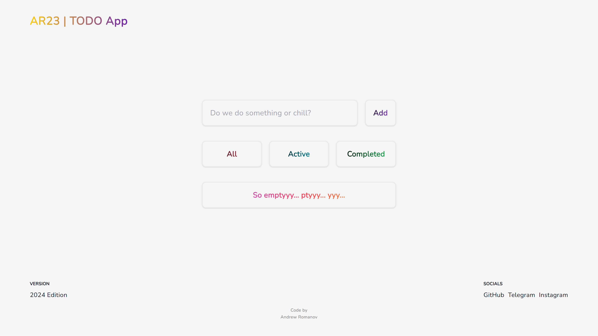

# TODO App - Next.js 14 + TypeScript + Tailwind CSS + shadcn/ui

Тестовое задание Frontend junior в Mindbox

### Screenshots

## How to use

- Clone repository and `cd` into it
- `npm i`
- `npm run dev`

Open [http://localhost:3000](http://localhost:3000) with your browser to see the result.

### Live Demo

[Click](https://todo-app-alpha-bice-56.vercel.app)
